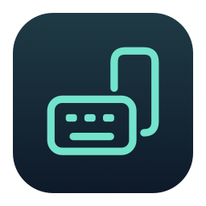
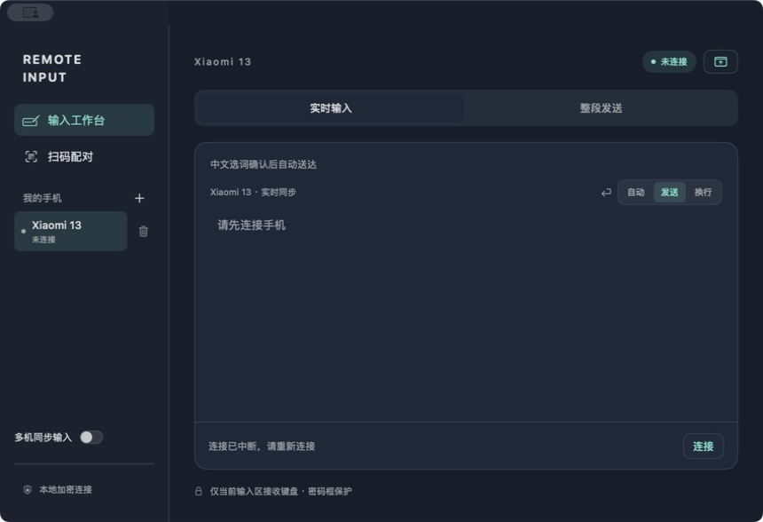
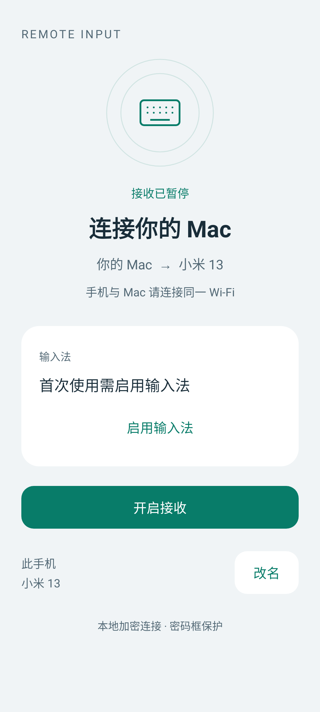
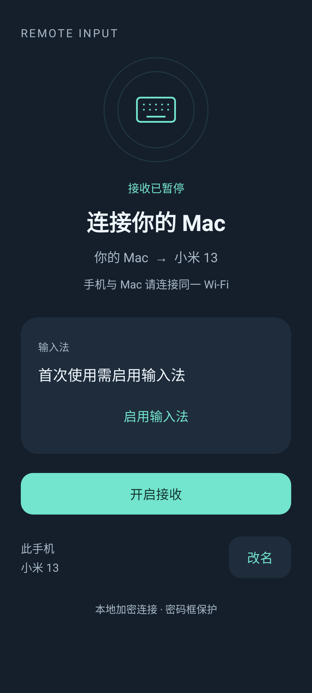

  

<h1 align="center">WiFi Remote Input</h1>

<strong>用 Mac 的键盘，在 Android 手机上打字。</strong>

中文聊天、长段文字、多台手机，都可以在电脑上完成输入。 同一 Wi-Fi，扫码连接，不用数据线。

  <a href="#界面一览">界面一览</a> ·
  <a href="#能做什么">能做什么</a> ·
  <a href="#开始使用">开始使用</a> ·
  <a href="#常见问题">常见问题</a>

## 界面一览

### Mac：一个工作台，管理手机和输入

在左侧选择手机，在右侧输入文字。在「实时输入」与「手机控制」之间切换，回车的行为也由你决定。

*Mac 客户端实际截图，图中手机尚未连接。*

### Android：连接状态，一眼看清

手机端显示接收状态、双方设备名称和输入法是否就绪。首次设置完成后，不再重复展示设置按钮；需要配对时，二维码直接显示在页面中。

  
  &nbsp;&nbsp;
  

*以上为当前 Android 界面的程序渲染预览，展示首次使用状态，并非手机截图。两端均自动跟随系统的浅色／深色模式。*

## 能做什么

| 功能 | 使用体验 |
| --- | --- |
| 中文实时输入 | 用熟悉的 Mac 输入法打字，选词确认后自动送到手机，不必每次点击发送。也支持英文、表情和粘贴文字。 |
| 看着手机内容编辑 | 实时输入框显示手机当前输入框的内容，可以继续输入、删除、选中替换或移动光标。需要手机应用支持读取输入框内容。 |
| 手机控制 | 开启可选辅助功能后，捕获 Mac 鼠标：左键点击／拖动、右键返回；点中输入框后直接打字，Esc 退出。 |
| 自选回车行为 | 为每台手机选择「自动」「发送」或「换行」；`Shift + Enter` 始终用于换行。 |
| 全局快捷键 | 默认 `⌥⌘I` 呼出小窗并聚焦输入区；工作台侧栏可修改或停用，重启后保留设置。 |
| 状态栏小窗 | 打开时自动尝试连接已选手机，也可点击小窗中的连接按钮重试；连接成功后点击输入区继续，需要时展开工作台。 |
| 扫码配对 | Mac 扫描手机展示的二维码，无需手动填写地址或配对码；配对后记住设备，方便下次连接。 |
| 换网自动找回 | 两端升级到 0.7.0 后，连接中断可在新局域网重新寻找已配对手机；认证成功后更新地址，输入仍保持暂停。 |
| 多台手机切换 | 在「我的手机」中保存多台设备，点击名称即可切换输入对象。 |
| 多机同步输入 | 勾选多台手机，将文字与按键发送到这些手机各自聚焦的输入框。 |
| 友好设备名称 | 自动获取设备名称，手机也可以改名，多台设备更容易区分。 |
| 输入状态提示 | 手机未选中输入框、锁屏或进入密码框时暂停，并提示处理原因。 |

这是一个**手机输入与键盘控制工具**。默认专注文字输入；开启可选的手机辅助功能后，还可以返回、进入主页、选择并点击界面控件。支持鼠标映射触控，操作时请看手机上的指针；当前不提供手机投屏。

## 开始使用

### 1. 准备好两端应用

你需要一台运行 **macOS 13 或更新版本**的 Mac，以及一台运行 **Android 10 或更新版本**的手机。两端安装 WiFi Remote Input，并连接同一 Wi-Fi；首次扫码需要 Mac 摄像头。

当前项目仍在持续开发，仓库提供源码，安装包需要自行构建，步骤见[构建与验证](docs/development.md)。已经拿到 `.app` 和 `.apk` 的用户可以直接安装；手机不需要开启开发者模式、USB 调试，也不需要 Root。

已在 MacBook Pro 与小米 13 / HyperOS 上验证基本输入和扫码配对，Android 新界面也已通过用户实机验收。其他机型与应用的表现可能有所不同。

### 2. 在手机上开启接收

打开手机 App，按页面提示完成「启用输入法」和「选择输入法」，然后点击「开启接收」。首次使用按系统提示允许通知，以便接收服务在后台运行。

输入法就绪后，点击「显示配对二维码」。

### 3. 用 Mac 扫码

在 Mac 客户端点击「扫码配对」，允许摄像头访问，将手机上的二维码对准 Mac 摄像头。识别成功后完成配对和连接。

二维码两分钟内有效，只能使用一次；收起后也会失效。过期时重新生成即可。

### 4. 开始打字

在手机打开备忘录或聊天应用，点选一个普通输入框。回到 Mac，点击实时输入区，输入：

> 你好，小米 13 👋

中文选词确认后，文字会自动抵达手机。需要操作手机界面时，切换到「手机控制」。

之后使用时，在手机开启接收，在 Mac 选择已保存的手机并连接即可。两端升级至 0.7.0 后，Mac 会在局域网寻找已配对手机的新地址。已发起过连接的手机因换网断开时可自动重连，恢复后需点击输入区继续；手动断开则不会自动重连。应用重启后仍需点击连接。自动发现被网络阻止时，可以重新扫码更新地址。

## 多台手机怎么用

- **添加**：点击 Mac「我的手机」旁的 `+`，扫描另一台手机的二维码。
- **切换**：点击列表中的手机名称，再点击输入区继续。其他手机的连接可以保持在线。
- **同步输入**：开启「多机同步输入」，勾选接收手机并连接，在每台手机上点选输入框，然后在 Mac 输入。
- **忘记设备**：点击手机列表中对应的删除按钮。手机端也可以忘记已配对电脑。

同步输入会发到每台手机自己的光标位置，**不会让多台手机的整篇内容自动保持一致**。输入区预览只对应当前选中的手机。任一手机无法接收时会暂停整组；部分手机可能已经收到上一条输入，继续前请逐台检查。

目前一台 Mac 可以连接多台手机，但每台手机只保留一台已配对 Mac。重新配对另一台 Mac，会使原电脑的配对失效。

## 隐私与输入保护

- **仅在本地网络传输**：连接经过加密与设备认证，不经过云端中转，未配对的电脑不能输入。
- **密码框禁止远程输入**：锁屏时也会拒绝输入。密码识别依赖手机应用正确标记输入框类型。
- **不保存输入历史**：用于同步显示的文字只在内存中处理，不写入文件或日志；配对码和密钥也不会写入日志。
- **键盘只作用于当前输入区**：切到其他 Mac 窗口后暂停，避免影响其他软件。纯文字输入无需授予手机辅助功能权限。
- **断线不自动补发**：避免重复文字或误发消息；检查手机状态后再继续。

Mac 会使用系统钥匙串保存配对凭据，用于下次识别设备，不用于存储你输入的文字。

## 常见问题

### 手机提示「没有聚焦的输入框」怎么办？

先在手机打开目标应用，点击要输入的位置，并确认当前选中 WiFi Remote Input 输入法。再回到 Mac 点击输入区继续；仅连接手机并不代表手机已经准备好接收文字。

### 为什么微信按 Enter 没有发送？

可以先将 Mac 的回车模式切换为「发送」。若微信版本提供「回车键发送消息」，请在微信「我 → 设置 → 聊天」中开启它。不同应用对回车的处理不同；若应用不响应输入法的发送动作，仍需在手机点击发送。

### 为什么电脑上没有显示手机的完整文字？

部分手机应用不允许输入法读取完整内容，过长的内容也不会显示。此时客户端会提示同步不可用；仍可发送文字和按键，但不会用发送历史冒充手机的实际内容。详细限制见[输入行为说明](docs/input-behavior.md)。

### 扫码后无法连接，或切换手机应用后断开？

检查两端是否在同一 Wi-Fi、手机是否开启接收。访客网络可能禁止设备互连或阻止自动发现；先确保两端在同一个可互通的网络。自动发现不可用时可重新扫码，扫码不能绕过网络隔离。HyperOS 若限制后台运行，请在系统电池设置中允许 App 后台运行，并保留接收服务的通知。

### 怎么打开小窗、暂停或退出？

点击 Mac 顶部状态栏图标，或按 `⌥⌘I` 呼出小窗并聚焦输入区，右上角可展开工作台。工作台侧栏「呼出小窗」可设置包含 `⌘` 或 `⌃` 的字母／数字组合，按 `Esc` 取消录入；无法注册时会提示更换，并保留原快捷键。应用需保持运行，退出后快捷键不生效。小窗中按 `Esc` 会暂停输入并收起窗口；中文候选阶段优先取消选词。切到其他窗口也会暂停实时输入。手机点击「暂停接收」停止接收；Mac 使用 `⌘ Q` 退出应用。

## 项目文档

- [构建与本地验证](docs/development.md)
- [输入行为与多设备说明](docs/input-behavior.md)
- [架构设计](docs/architecture.md) · [通信协议](protocol/README.md)
- [验证记录](docs/validation.md) · [问题反馈](https://github.com/maxjchuang/wifi-remote-input/issues)

## 开源许可

采用 **AGPL-3.0-only**，见 [LICENSE](LICENSE)。第三方依赖及许可证见 [THIRD_PARTY_NOTICES.md](THIRD_PARTY_NOTICES.md)。复用代码时须保留原始版权和许可证声明。

## 可选：用鼠标控制手机

更新两端至 0.9.3 后，在手机 App 的「手机控制」卡片点击「开启辅助功能」，在系统设置中启用 **Remote Input 手机控制**。然后在 Mac 工作台或小窗选择「手机控制」，点击控制区捕获鼠标。手机上会出现圆形指针和可点击的暂停标记，Mac 鼠标会暂时隐藏。若更新后触控不可用，请在手机系统设置中关闭再开启该辅助功能。

| 操作 | 按键／入口 |
| --- | --- |
| 移动手机指针 | 移动 Mac 鼠标 |
| 点击手机屏幕 | 左键按下并松开 |
| 拖动／滑动 | 按住左键移动，松开结束 |
| 长按 | 按住左键不动 |
| 返回上一页 | 鼠标右键 |
| 按位置选择控件（辅助操作） | ↑ ↓ ← → |
| 按顺序选择 | Tab / Shift+Tab |
| 点击／长按选中控件 | Enter / Shift+Enter |
| 滚动选中控件所在区域 | Page Up / Page Down（Mac 可用 Fn+↑ / Fn+↓） |
| 返回、主页、最近任务 | 控制区下方按钮 |
| 暂停 | Esc、切换 Mac 窗口，或手机浮动暂停标记 |

Android 0.9.1 起，控制期间手机保持屏幕常亮；退出控制、断线超时或停止接收后恢复系统自动息屏，仍可手动按电源键锁屏。

小窗按 Esc 同时收起。控制仅作用于当前选中的手机，不参与「多机同步输入」。没有开启辅助功能也能照常输入文字。坐标点击无需 App 支持键盘焦点或可访问控件，仍受 Android 系统触控与锁屏限制。此版本支持移动、点击、按住拖动、长按与返回，尚不映射滚轮或多点触控；键盘节点操作仍取决于应用支持。此版本不传输手机画面或控件文字。

### 控制手机时直接打字

Mac 0.9.5 起，进入「手机控制」并捕获鼠标后，点中手机上的普通输入框即可直接使用 Mac 键盘输入，不必退出捕获或切换页面。控制区同步显示手机文字，中文使用 Mac 输入法选词后送达。回车沿用「自动／发送／换行」设置。没有输入框或进入密码框时只暂停文字，鼠标仍可操作；中文组词时 Esc 先取消组词，其他时候 Esc 退出捕获。此模式只向当前手机输入。手机端沿用 0.9.3。
