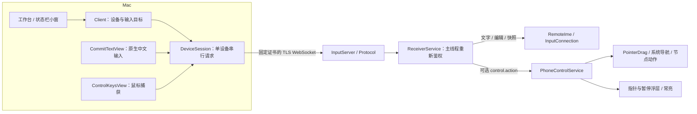

# 架构设计

[项目首页](../README.md) · [开发与验证](development.md) · [协议](../protocol/README.md)

本文描述两端 0.9.6 的实现。历史演进与各次测试结果见[验证记录](validation.md)。

## 两条能力链路，共用认证连接

普通文字通过 Android 输入法提交，不依赖辅助功能。手机控制需要用户单独启用 AccessibilityService，通过系统手势、节点动作和全局导航操作手机，不依赖 ADB、Root、USB 或云端服务。不传输手机屏幕、节点树或控件标签；文字同步单独走受保护的输入框快照。

## 组件职责

| 位置 | 入口与职责 |
| --- | --- |
| macOS `Client.swift` | 已保存设备、当前设备、显式多机文字接收者、切换与暂停 |
| macOS `App.swift` / `DeviceSession` | 每台手机的认证连接、输入队列、快照、控制队列及连接代次 |
| macOS `RemoteCore/CommitTextView.swift` | 原生 NSTextView 组词、镜像编辑、失焦丢弃未确认候选 |
| macOS `PhoneControlPanel.swift` | 控制页、键鼠协同、MouseCaptureLease 与局部事件监听 |
| macOS `DeviceDiscovery.swift` | Bonjour 发现已配对手机的候选地址 |
| Android `InputServer.kt` / `Protocol.kt` | TLS WebSocket、严格报文校验、鉴权、限流、连接身份 |
| Android `ReceiverService.kt` | 用户启动的前台服务、主线程调度、执行前重新鉴权、NSD 生命周期 |
| Android `RemoteIme.kt` | 输入框保护、Unicode 提交、按键、快照、比较后编辑 |
| Android `PhoneControlService.kt` | 单连接控制权、租期、锁屏检查、节点/坐标操作、浮层 |
| Android `PointerDrag.kt` / `PointerMotion.kt` | 连续触摸的合并与释放 / 仅用于显示的指针插值 |

## 配对与信任边界

Android 提供 TLS 1.3 WebSocket。二维码携带私有 IPv4 地址、完整证书 SHA-256 指纹和两分钟有效的一次性码；Mac 验证证书后才发送配对码或凭据。配对码全局最多五次猜测，使用后失效。

Mac 将设备密钥存入 Keychain；Android 只保存其哈希。手机证书私钥位于应用私有 no-backup 目录，禁止应用备份。一台手机只授权一台 Mac，新配对替换旧密钥；一台 Mac 可以分别保存多台手机。友好名称只是显示信息，不能替代证书与密钥。撤销后已有连接的下一次操作也会重新鉴权。

日志不记录文字、剪贴板、配对码或密钥。文字和快照仅在内存处理。密码框和锁屏在读取及写入前检查；坐标触控另外拒绝可识别的密码节点，不能将该检查视为对任意自绘密码界面的识别保证。

## 文字输入和多设备

每台手机独立维护连接、队列和快照，同一连接一次只有一个请求在途；输入、快照、保活和控制共享此约束。断线后不重放输入，丢失确认意味着执行结果不确定。

普通单机编辑使用 `editorId` 和文本/选区哈希防止过时编辑覆盖新输入框；Android 只替换变化范围并保留 Unicode 代理对。快照要求完整文本，最大 2048 UTF-16 单位。实时输入约每 250ms 尝试刷新，忙时跳过；它不是跨进程原子同步。

多机文字发送使用显式接收者集合，按各手机自己的光标提交，不复制预览手机的整篇文档。改变目标或任一接收者失败会暂停整组。群发不具备原子性，已完成的发送无法回滚。控制及控制中的文字始终直接路由到当前 DeviceSession。

## 捕获与控制权

点击控制区请求 `pointer_start`，手机确认后核验 Mac 窗口仍为 key window、控制视图仍为 firstResponder，再捕获鼠标。不能在网络往返后重新以全局鼠标位置判断点击有效性；0.9.6 已移除此检查。迟到的确认不得复活已取消或失焦的请求。

MouseCaptureLease 用 CGAssociateMouseAndMouseCursorPosition 与 NSCursor 平衡光标关联和可见性；重复开始、释放、销毁必须幂等。仅安装局部 NSEvent 监听，不安装全局事件 tap，也不申请 Mac 辅助功能或输入监控权限。窗口失焦、Esc、模式/设备切换、断线、手机暂停均结束捕获。

手机将控制权绑定到 WebSocket 实例；另一连接不能抢占或停止现有控制者。Mac 每两秒保活，手机每 500ms 检查授权、锁屏与六秒租期。停止时移除指针和暂停浮层，并释放其 FLAG_KEEP_SCREEN_ON；不会改写系统息屏设置或解锁手机。

## 连续触摸与指针显示

Mac 将相对位移映射为 0…10000 的归一化坐标，以最高 30Hz 采样，控制请求间隔至少约 33.3ms。只合并相邻同类移动，保留 down/up 等顺序边界；控制队列上限 32，过载停止控制。实际响应速度受往返延迟和同连接其他请求影响。

Android 按真实显示尺寸映射坐标。PointerDrag 用 `willContinue` / `continueStroke` 延续同一个触点，一段执行中只保留最新待移动位置，up 必须最终释放。停止或撤销会丢弃待移动并尽力结束手势；不能撤销已经发生的按下或目标应用的松手行为。

`touch_not_down` 只中断本次拖动。Mac 保持捕获，将松开前的后续拖动降为指针移动，直到物理松开再按下；不得自动补发 touch-down。

PointerMotion 通过 Choreographer 做 32ms 线性插值，仅平滑显示，不修改触控坐标。静止或停止时取消帧回调；30Hz 网络采样不等于手机显示帧率保证。

## 键鼠协同与焦点

ControlKeysView 继承原生 CommitTextView，在持有鼠标捕获的同时接收中文输入。每 200ms 尝试刷新普通输入框快照，忙或按住左键时跳过。有效快照恢复文字；无输入框、密码框或快照不可用时禁止协同打字，但鼠标仍可操作。

点击或返回会丢弃本地组词和旧快照，等待新的输入目标。editorId 变化也会丢弃旧组词。没有输入框时，方向键、Tab、Enter 可用于可访问节点操作；有效输入框内优先由原生编辑器处理。Esc 在组词时交给输入法，否则退出捕获。

文字拒绝不能调用整个控制会话的停止逻辑。失焦清理只处理本视图的 marked range，不能调用全局输入上下文的清理方法，以免破坏其他 Mac 软件的中文选词。

## 换网发现

Android 监听成功后发布 `_wri-input._tcp.`，停止接收时撤销；TXT 只包含协议版本与公开证书指纹。Mac 只考虑已保存指纹对应的私有 IPv4 地址，候选缓存 35 秒，自动重连每设备至少间隔 30 秒。

广播是未经信任的路由提示。连接仍使用原证书指纹和密钥，认证成功才保存新地址。手动断开、忘记或认证失败停止自动重连；恢复后文字保持暂停，控制需要重新点击开始。访客网络隔离或组播受限时发现可能失败，重新扫码也不能绕过网络隔离。
